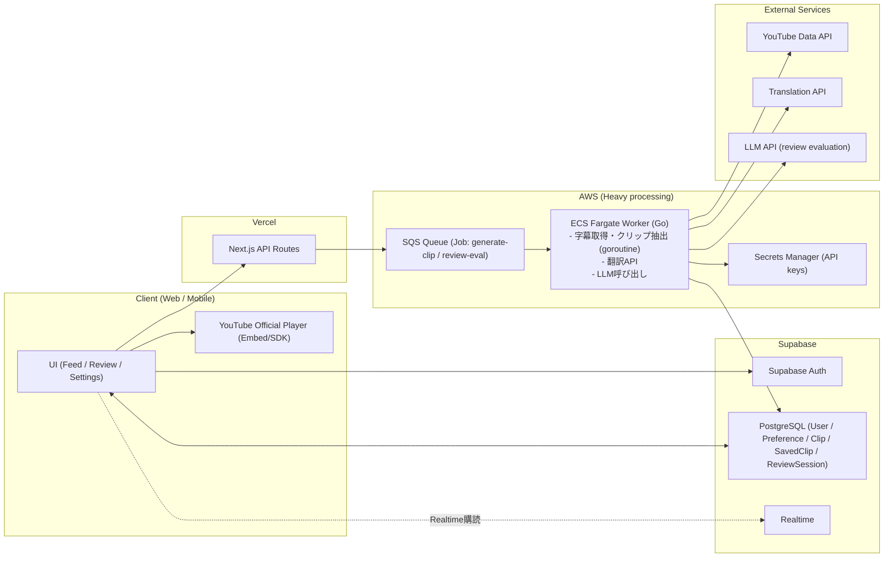
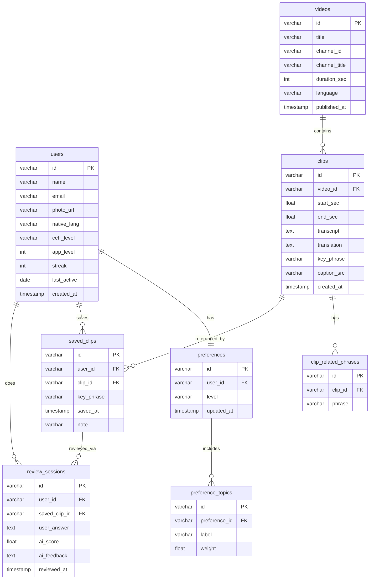

# Design Document

## 1. Introduction and Overview

### Context

<!--
背景・状況を書く
なぜこのプロジェクトが必要になったのか
-->

英単語・表現学習の際にモチベーションを維持するのが大変だと感じたことがあり、学習のモチベーションを維持させるためのアプリケーションを作ろうと考えた。

### Problem

<!--
このアプリケーションで解決したい課題
現状の何が問題なのか
-->

- ただ単語や表現を見て覚える単純作業の繰り返しでモチベーションが低下すること
- 単語帳で学習する多くの場合、リアルな文脈と切り離されていること
- ユーザが主体的に学ぶ単語や表現を選択することのできる単語学習コンテンツが少ないこと

### Goals and Non-goals

#### Goals

<!--
このプロジェクトで達成したいこと
-->

- 英単語学習を楽しく＆実用的にする
- ユーザの好みに合わせたコンテンツで単語学習を可能にする
- AIを用いて効果的に復習ができるようにする
- クリップ作成から表示までをストレスなく行うUXを実現する

#### Non-goals

<!--
今回はやらないこと（スコープ外）
-->

- ユーザ間の連携機能

---

## 2. Evaluation Metrics

- 検索で提示されたクリップがユーザの好みに一致しているかを、再生開始率・視聴継続率（例: 一定秒数以上の視聴）・保存率で評価する
- 学習体験が途切れずに継続できているかを、セッションあたりの学習クリップ数・離脱率で評価する
- 復習（文章作成）機能の有効性を、AI判定スコアの推移（正確さ/自然さ）および復習後の再学習率で評価する
- 推薦（復習候補/関連単語）の妥当性を、提示後の実行率（復習開始率）・保存率で評価する

---

## 3. Requirements

### Functional Requirements

<!--
機能要件（ユーザーやシステムが「できること」）
箇条書きでOK
-->

#### Learning / Feed Experience

- ユーザは、入力した好み（Preference）に基づいてYouTube上の動画を探索し、学習に適したクリップを**feed形式（順次提示）**で学習できる
- 学習画面では一度に1クリップを表示し、次の学習候補へ容易に遷移できる（例: ボタンまたはスワイプ）
- 検索結果はすべて一覧表示せず、学習に適したクリップを順次提示する
- feedが途切れないよう、必要に応じて追加の学習候補を取得・生成する

#### Clip Definition / Playback (Copyright-safe)

- クリップは動画データを保存せず、YouTubeの動画IDと再生区間（start/end）のみを保持する
- クリップ再生は**YouTube公式プレイヤー**を用いて行い、指定した区間のみを再生する（再配布や自前配信は行わない）
- 同一動画から連続してクリップを提示しない

#### Clip Generation / Selection

- Preferenceに基づいて候補動画を探索し、その中から学習に適した区間を抽出してクリップ（start/end）を生成する
- クリップ抽出時は、学習単語を含む**文が完結している区間**を優先して切り出す
- 字幕が利用可能な動画のみを探索対象とする
- （優先度低）一定の品質基準（例: 字幕品質、音声の明瞭さ、過度なノイズがない等）を満たす動画を優先する

#### Search Strategy (Bounded but Endless UX)

- 動画探索は段階的に行い、初回は限定された件数の候補のみ取得する
- 学習単語を含む有効な例文（=クリップ候補）が一定数見つかった場合、それ以上の探索は行わない
- 残り件数などの明示的な数値は表示しない
- ユーザの操作（スキップ/保存/学習継続など）に応じて、学習候補（feed）は動的に更新される

#### Subtitle / Translation UI

- クリップ再生画面では、英語字幕と日本語訳を表示できる
- 英語字幕・日本語訳はそれぞれ表示/非表示を切り替え可能
- 学習対象の単語はハイライトなどによって視覚的に区別される

#### Review / Recall (AI-assisted)

- ユーザは過去に学習した単語を復習できる
- 復習では、ユーザが学習済み単語を用いた英文を作成し、AIが**正誤（意味的妥当性）**および**自然さ**を評価する
- 復習時の提示内容は、過去に学習したクリップの文脈（例文/字幕）を活用できる

#### History / Saved Items

- ユーザは学習した単語やクリップを保存できる
- ユーザは単語単位で、過去に保存した/学習したクリップを見返せる（例: 単語→クリップ一覧）
- 学習履歴は日付などの単位で閲覧できる

#### Recommendations

- 過去の学習履歴に基づいて、関連する単語をおすすめとして提示できる
- 視聴・復習が少ない単語を復習候補として推薦できる

#### Preferences

- ユーザはメイン画面（または設定画面）から好み（Preference）を更新できる

### Non-functional Requirements

<!--
非機能要件（性能・可用性・セキュリティなど）
-->

- 同時アクセス1000人まで安定

---

## 4. System Architecture

<!--
システム全体の構成
フロントエンド / バックエンド / DB / 外部サービスなど
図があれば貼る
-->

### High-level

### Deployment / Hosting Strategy

- フロントエンドおよび API ルートは Next.js on Vercel で管理する
- 認証・データ管理・リアルタイム購読は Supabase（Auth / PostgreSQL / Realtime）で一元管理する
- クライアントは操作の種類によって通信先を使い分ける
  - 認証・データ読み取り・リアルタイム購読 → Supabase に直接アクセス
  - クリップ生成・復習評価など非同期ジョブが必要な操作 → Next.js API Routes 経由で SQS にジョブ投入
- 重い処理（動画探索、字幕処理、クリップ区間抽出、翻訳、LLM評価）は AWS の非同期ワーカーで実行する
- Fargate ワーカーは Go で実装し、goroutine による並行処理で複数動画の字幕取得・LLM 呼び出しを効率化する
- ワーカーは処理結果を Supabase（PostgreSQL）に書き戻し、クライアントは Supabase Realtime で更新を検知して feed を更新する
- Clip は動画データを保存せず、videoId と再生区間（start/end）のみを保持し、再生は YouTube 公式プレイヤーで行う
- （将来）RAG 実装時は Python Worker を別コンテナとして Fargate に追加する

---

## 5. Data Design

<!--
データ構造・スキーマ設計
テーブル / コレクション / 主キー / インデックスなど
-->

### 5.1 ERD

## 6. APIs

### Endpoints

<!--
主要なAPIエンドポイント一覧
-->

### Authentication

<!--
認証・認可方式
-->

### Error Handling

<!--
エラー時のレスポンス方針
-->

---

## 7. User Interface Design

### Screens

<!--
画面一覧
-->

### Screen Transitions

<!--
画面遷移
-->

### Key Operations

<!--
主要なユーザー操作
-->

---

## 8. Assumptions and Dependencies

### Assumptions

<!--
前提条件
-->

### Dependencies

<!--
外部API・外部サービス・ライブラリなど
-->

- フロントエンド・API Routes は Vercel（Next.js）で管理する
- 認証・DB・リアルタイム購読は Supabase（Auth / PostgreSQL / Realtime）で管理する
- 重い処理は AWS（SQS + ECS Fargate ワーカー）で実行する。ワーカーから Supabase への書き込みは pg ドライバで直接接続する

---

## 9. Alternatives Considered

<!--
検討した別案と、それを採用しなかった理由
-->

- このアプリの作成はAWSの学習も兼ねているため全てにAWSを採用することも考えたが、MVPの完成速度を優先したいためSupabase + AWSのハイブリッドにした。
- バックエンドAPIを独立したサーバー（AWS Lambda / ECS Fargate）として構築することも検討したが、ライトな処理はNext.js API Routesで十分であり、Vercelのデプロイ自動化の恩恵を受けるためこの構成とした。重い処理のみFargateワーカーに委譲する。
- DBをFirestore（NoSQL）ではなくSupabase（PostgreSQL）にしたのは、SQLが使えること・認証とリアルタイム購読がビルトインで揃っていること・ERDをそのままDDLに変換できることが理由。AWS RDSも検討したがリアルタイム購読を自前実装するコストが高く、MVPでは過剰と判断した。
- FargateワーカーをGoで実装するのは、goroutineによる並行処理で複数動画の字幕取得・LLM呼び出しを効率化するため。LLM呼び出し自体はHTTPリクエストであり言語に依存しないため、Pythonは不要と判断した。将来のRAG実装時のみPython Workerを別途追加する。

---

## 10. Failure Cases / Limitations

<!--
想定される障害・制限事項・現在の限界
-->

- 学習に適した候補が一定数見つからない場合、学習セッションを終了する
- 外部APIの制約により、取得可能な候補数には上限がある
- 学習に適した候補が十分に見つからない場合、体験が限定される可能性がある
- 特定の単語やニッチな分野では、十分な例文が得られない可能性がある

## 11. Personal

- テスト、CI/CD、コンテナ、デプロイを経験する
